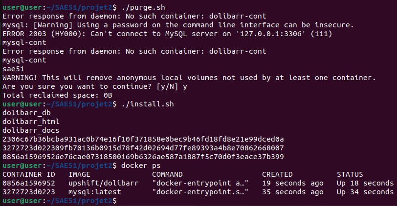
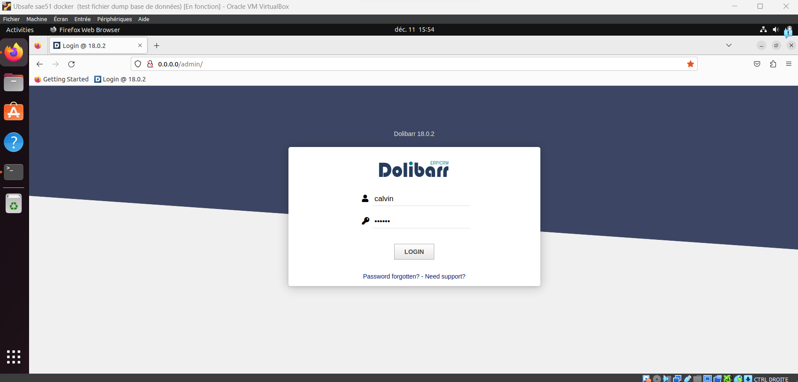
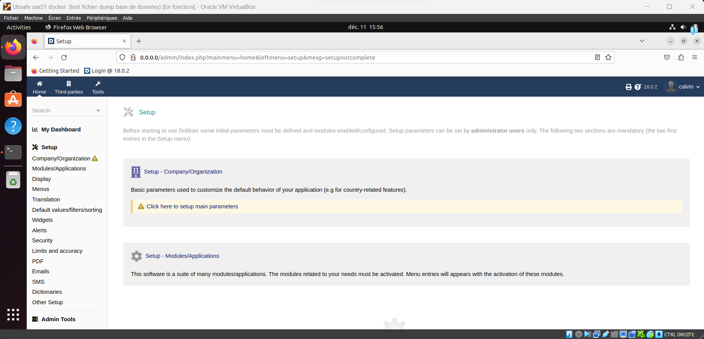
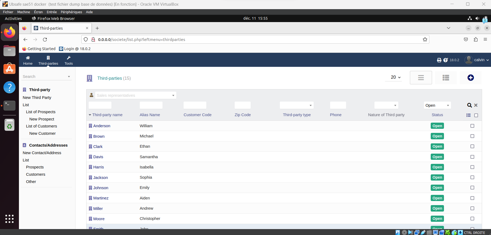
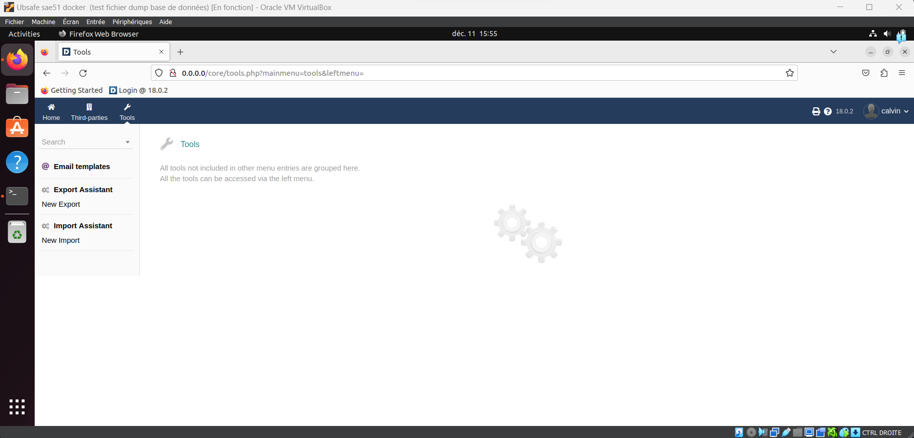

# SAE51 - Projet 2 : Installation d'un ERP/CRM
*Fait par **Calvin Cartier***\
*Le 20/11/2023*\
*Groupe **FI***

## Étapes du projet
- Installation manuelle
  - Erreur rencontrés
  - Insertion de doonnées
- Installation en Docker (avec une image)
  - Image tuxgasy/Dolibarr
  - Image upshift/Dolibarr
    - Installation automatique des modules
    - Insertion des données
- Annexe

## Installation manuelle de Dolibarr (v18.0.3)
### Outils utilisés :
- VM Ubuntu v22.04
- PHP v8.1.2
- Mariadb v5.5+

Après plusieurs tentatives d'installation suivies d'échecs en ayant suivi les étapes du wiki Dolibarr, j'ai décidé d'utiliser un tutoriel externe.

**Types d'erreurs rencontrées :**
- Impossibilité d'accéder à la page web Dolibarr.
- Erreur lors de la connexion avec la base de données lors de l'installation.
- Erreur avec l'utilisateur Dolibarr qui ne pouvait pas se connecter.
- Problème avec l'import de données car la base de données n'était pas liée à Dolibarr.

Lien du tutoriel suivi : [How to Install Dolibarr on Ubuntu 20.04](https://www.vultr.com/docs/how-to-install-dolibarr-on-ubuntu-20-04/)

En suivant ce tutoriel, j'ai pu installer un Dolibarr fonctionnel avec sa dernière version et une base de données accessible par l'outil Dolibarr.

## L'insertion de données
J'ai essayé d'insérer les données SQL reprises de l'ancien projet sur la nouvelle base de données via la commande d'insertion fournie dans l'outil Dolibarr.

Un premier problème a été rencontré car la connexion à la base de données ne se faisait pas en raison d'une erreur de droit.

**Solution trouvée :** Donner les droits d'accès et les données étaient accessibles.

## Installation Dolibarr avec Docker
### Outils utilisés :
- Image tuxgasy/dolibarr

J'ai utilisé l'image tuxgasy/dolibarr car c'est l'image recommandée sur le site Dolibarr pour un environnement de production et non de développement.

Lien de l'installation Dolibarr avec Docker : [Installation - Upgrade](https://wiki.dolibarr.org/index.php?title=Installation_-_Upgrade#Install_Dolibarr)

Lien de l'image Docker : [tuxgasy/dolibarr](https://hub.docker.com/r/tuxgasy/dolibarr)

Cette image m'a posé beaucoup de problèmes pour l'importation des données dans le SGBD avec une base de données MySQL.

Pour résoudre le souci d'installation, je suis passé sur MariaDB comme indiqué sur le site DockerHub, et le Dolibarr est fonctionnel.

Cependant, un deuxième problème est survenu une fois sur la page de connexion : le module tiers n'était pas activé malgré l'ajout de ce module via le Docker Compose.

## Changement d'image Docker
### Outils utilisés :
- Image upshift/dolibarr

Lien de l'image Docker : [upshift/dolibarr](https://hub.docker.com/r/upshift/dolibarr)

En faisant mes recherches, je suis tombé sur l'image upshift/dolibarr qui permet de spécifier les modules que l'on souhaite installer pour notre Dolibarr grâce à la variable d'environnement : "DOLI_MODULES= ". Le module qui nous intéresse est le module tiers qui se nomme "modSociete" sur Dolibarr.

J'ai d'abord essayé avec le fichier Docker Compose, mais il y avait certains bugs dans la composition du Docker Compose. J'ai donc pris les différentes variables d'environnement pour les mettre dans un script avec deux Docker Run. 

Le premier Docker Run est pour la création d'un conteneur MySQL et l'autre pour le conteneur Dolibarr. Ensuite, je crée un réseau SAE51 et mets les deux conteneurs sous ce réseau Docker qui permet de mettre en relation les deux conteneurs.

Après l'installation, j'avais bien accès à tous les menus et surtout au module tiers.

Ensuite, j'ai créé des entrées dans le module tiers manuellement pour voir la structure des données pour ensuite pouvoir insérer des données directement dans la base de données.

L'import fonctionne avec les fichiers CSV, mais cela requiert une action manuelle de la part de l'administrateur.

Finalement j'ai réussi a faire de limport csv en ajoutant les données directement dans la base de données.

## Annexe
- [Lien Doc Dolibarr](https://wiki.dolibarr.org/index.php?title=Home)
- [Lien Forum](https://www.dolibarr.org/forum/t/available-db-with-real-realistic-data/17579)
- [Lien Démo Données Dolibarr](https://demo.dolibarr.org/public/demo/index.php)
- [Lien Fichier Démo Données Dolibarr](https://github.com/Dolibarr/dolibarr/tree/develop/dev/initdemo)

## Images

#### Purge du docker et lancement de l'installation

#### Page de connexion

#### Page admin

#### Page tiers

#### Page outils

